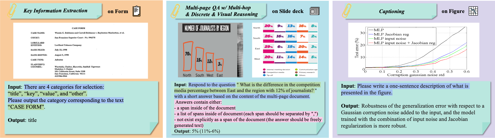

# InstructDoc: A Dataset for Zero-Shot Generalization of Visual Document Understanding with Instructions
This repository includes the InstructDoc dataset introduced by the following paper: Ryota Tanaka, Taichi Iki, Kyosuke Nishida, Kuniko Saito, and Jun Suzuki. "InstructDoc: A Dataset for Zero-Shot Generalization of Visual Document Understanding with Instructions". In Proc. of AAAI. 2024.

> We introduce InstructDoc, the first large-scale visual instruction tuning dataset that covers a wide range of VDU tasks and datasets.




# Get Started
## 1. Download datasets
```
sh download.sh
```
This script helps you to download most of the datasets automatically. For some datasets, due to the license issue and downloading restrictions, you need to manually download them by following the instructions in [download_scripts/README.md](download_scripts)

## 2. Preprocess datasets
```
sh process_data.sh API_KEY
```
This script helps you to process all the datasets. To extract OCR information from document images, we used Google Vision API and set the variables "API_KEY" to the API key obtained from [Google Cloud Platform](https://cloud.google.com/). To get one visit the [link](https://cloud.google.com/vision/docs/quickstart). <br><br>
If you encounter the FileNotFoundError while processing the datasets, please set the variable --input_data_dir in [data_processors](data_processors) to your dataset directory name correctly.

## 3. Merge preprocessed datasets
```
python merge_datasets --max_samples 5000 --input_data_dir processed_data --save_dir ./
```
We randomly sampled a maximum of 5000 instances for each held-in dataset. After processing datasets, you can obtain JSON files with the following format.
If the dataset provides multiple images per instance (e.g., SlideVQA), we add "_list" into the fields, including "image", "ocr", and "bboxes". 

<pre>
   {
      "dataset_name": dataset name,
      "id": identification of the instance,
      "image" or "image_list": image path,
      "ocr" or "ocr_list": ocr text,
      "bboxes" or "bboxes_list": [x1, y1, x2, y2, w, h],
      "conversations": [
        {'user': 'human', 'value': randomly sampled instruction}
        {'user': 'gpt', 'value': answer}
      ]
    }
</pre>

# Citation

You can cite it as follows:
```bibtex
@inproceedings{InstructDoc2024,
  author    = {Ryota Tanaka and
               Taichi Iki and
               Kyosuke Nishida and
               Kuniko Saito and
               Jun Suzuki},
  title     = {InstructDoc: A Dataset for Zero-Shot Generalization of Visual Document Understanding with Instructions},
  booktitle = {AAAI},
  year      = {2024}
}
```

If you have any questions about the paper and repository, feel free to contact Ryota Tanaka (ryota.tanaka[at]ntt.com) or open an issue!
